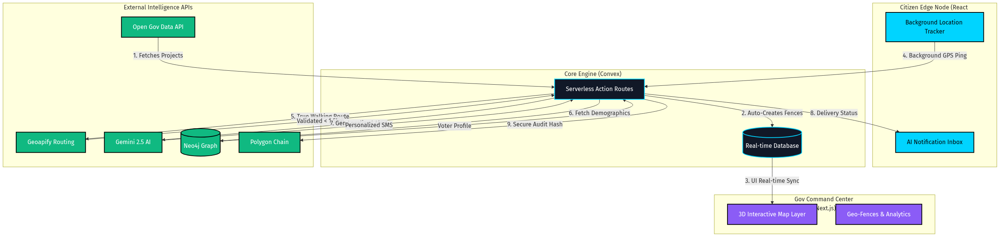

# JanSang AI 🏗️
### India's Geo-Fencing Civic Transparency Engine

> Built for the Digital Democracy hackathon track. Citizens get real-time, AI-personalized notifications when they walk near government infrastructure projects — with blockchain-verified official accountability.

## The Problem
₹5 lakh crore is spent on Indian infrastructure annually. Citizens have no idea what's being built, who's responsible, or if it's on time. Generic SMS blasts and billboards fail. We fix this.

## Our Solution
When a citizen walks within 500m of a government hospital, road, metro, or bridge project:
1. 📍 **Geo-fence triggers** via background location (100m movement threshold)  
2. 🤖 **AI selects the right message** from 18 variants (3 personas × 3 times × 2 languages)
3. 📱 **Push notification arrives** in English or Hindi, personalized to whether you're a commuter, parent, or general citizen
4. 🔗 **Blockchain proof** shows which official promised what — and whether they delivered
5. 💬 **Citizen can ask AI** about the project, report issues, or verify official claims

## Tech Stack
| Layer | Technology |
|-------|-----------|
| Mobile | React Native + Expo |
| Web Dashboard | Next.js 15 + Tailwind |
| Backend | Convex (real-time serverless) |
| AI | Google Gemini 2.5 Flash |
| Geospatial | Geoapify Routing API (real walking distance) |
| Blockchain | Polygon Amoy testnet (ethers.js) |
| Data | data.gov.in OGD API |
| Push | Expo Push Notifications |

## Key Features
- ✅ **Real background geo-fencing** — works even when app is closed
- ✅ **Speed filtering** — no notifications if you're in a vehicle (>20km/h)
- ✅ **18-variant AI messages** — right message for right person at right time
- ✅ **Blockchain accountability** — SHA-256 hash of official promises on Polygon
- ✅ **RAG AI assistant** — citizens can ask "who's responsible for this delay?"
- ✅ **OGD integration** — auto-creates zones from data.gov.in
- ✅ **AI image spam filter** — Gemini Vision validates issue photos
- ✅ **Configurable radius** — citizens choose 100m / 300m / 500m notification range
- ✅ **Before/after photos** — visual project progress tracking
- ✅ **Budget transparency** — every project shows budget in lakhs/crores

## Setup
### Backend (Convex)
1. \`npm install\` in the \`convex\` folder
2. Run \`npx convex dev\` to start the backend

### Web Dashboard
1. Fill `.env.local` with keys (Clerk, Convex, etc.)
2. Run \`npm run dev\`

### Mobile App
1. \`cd mobile\` and run \`npm install\`
2. Run \`npx expo start --clear\`

## Architecture

