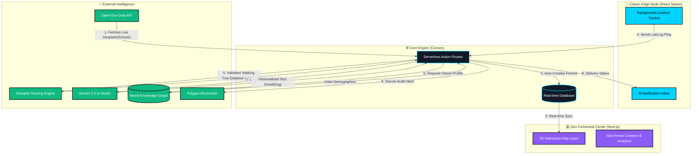

# GeoFenceAI - Hackathon Pitch Deck Guide

This document contains all the necessary content to fill out your presentation slides, ensuring your team completely understands the project's vision, architecture, and impact.

---

## 1. Project Overview & Aim
**What ++++++++++++++++++++++++++++++++++++++++++++++++++++++++++=is our project?**
GeoFenceAI is a Hyper-Local Citizen Targeting & Governance Engine. It bridges the communication gap between the government and citizens by using real-time geolocation, AI, and blockchain. 

**What is our aim?**
To replace generic, easily ignorable government broadcasts (like standard SMS blasts or billboards) with hyper-personalized, context-aware notifications. We aim to ensure citizens actually read, understand, and appreciate what the government is building right in their own neighborhoods.

---

## 2. Target Audience (For whom are we building it?)
This platform serves two distinct users (which is why we built two apps):

1. **The Government / City Planners (Web Dashboard):** 
   They need a macroscopic view of the city. They use our 3D Command Center to draw virtual boundaries (Geo-Fences) around new infrastructure projects (hospitals, schools, metro lines) and monitor citizen engagement analytics in real-time.
2. **The Citizens (Mobile App):**
   They need microscopic, personalized information. They install the app on their phones to receive push notifications in their native language the moment they physically walk near a new government project.

---

## 3. Advantages & Impact (Why use this?)
*   **Hyper-Relevance:** By only notifying citizens when they are physically near a project, engagement rates skyrocket. 
*   **AI Personalization (Gemini):** A 20-year-old student gets a different localized message about a new library than a 60-year-old local business owner. The AI tailors the message to the demographic.
*   **Language Inclusivity:** The AI translates alerts into local regional languages instantly.
*   **Transparency (Polygon Blockchain):** Every time a notification is sent, an immutable hash is recorded on the blockchain. The government can definitively prove that "X number of citizens in District Y were informed about this project," eliminating claims of poor communication.

---

## 4. Why Two Different Apps? (Web vs Android)
A complete system requires both a **Control Plane** and an **Edge Node**:
*   **The Next.js Web App (Control Plane):** Government officials cannot manage 3D city maps, real-time analytics graphs, and OGD API syncs from a tiny phone screen. They need a powerful, desktop-first command center. 
*   **The React Native Android App (Edge Node):** You cannot track a citizen's GPS coordinates securely and efficiently via a web browser while they are walking down the street with their phone in their pocket. A native mobile app running in the background is fundamentally required to trigger the Geo-Fence proximity alerts.

---

## 5. Architecture & Data Flow

You can insert this exact diagram into your PPT using a Mermaid visualizer.

---

## 6. Technology Stack (For the Tech Slide)
*   **Frontend Web:** Next.js 15, React 19, Framer Motion (Animations), Tailwind CSS.
*   **3D Visualization:** Three.js, React Three Fiber (for the Command Center Map).
*   **Frontend Mobile:** React Native, Expo, Expo Location Services.
*   **Backend / Database:** Convex Cloud (Serverless, Real-time WebSockets).
*   **Authentication:** Clerk (Secure Login).
*   **AI Engine:** Google Gemini 2.5 Flash (Contextual messaging & translation).
*   **Data Sources:** data.gov.in (OGD API) for live Indian infrastructure data.
*   **Geospatial:** Geoapify Routing API (for calculating true street-walking distance instead of flawed straight-line radius).
*   **Knowledge Graph:** Neo4j (Mapping relationships between citizens and nearby infrastructure).
*   **Blockchain:** Polygon / Ethers.js (For immutability and transparent audit trails).

---

## 7. Unique Selling Propositions (USPs / Features Slide)
1.  **Stop Relying on "As the Crow Flies":** We don't use basic circle radiuses. We integrated Geoapify to calculate the *actual walking distance* a human would take on the street to reach the infrastructure, preventing false-positive pings if a river or highway is blocking their path.
2.  **Zero-Touch Gov Operations:** By integrating with the Open Government Data (OGD) API, our system automatically creates Geo-Fences the moment the government publishes new project data online.
3.  **Cryptographic Proof of Governance:** We don't just say we sent a notification; we prove it mathematically by hashing the delivery receipts onto the Polygon Blockchain.
4.  **Full Stack Independence:** A unified Convex backend securely streams data to both a high-fidelity 3D web dashboard AND a native Android mobile application simultaneously in real-time.
