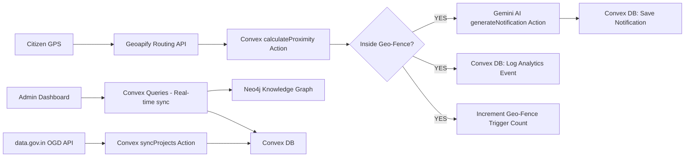

# CivicSentinel AI — Full Project Report

> **Version:** 0.1.0 (pre-launch)
> **Date:** March 2026
> **Author:** Generated via Antigravity

---

## 1. Project Vision

**CivicSentinel AI** is an intelligent, AI-powered **Hyper-Local Civic Targeting Engine** built for political strategists and government bodies. The core idea is to move away from broad, generic civic communication (banners, TV ads) and instead deliver **personalized, real-time governance updates** to citizens based on their physical location, relative to nearby government infrastructure projects.

### Problem Statement
Traditional government communication is:
- **Static** — city-wide banners nobody reads
- **Irrelevant** — a citizen near a new hospital sees ads for a bridge 30km away
- **Untransparent** — no clear way for citizens to verify project status or spending

### Solution
CivicSentinel AI uses **geo-fencing** (virtual GPS boundaries) around public infrastructure sites. When a citizen enters the boundary of a project (e.g., a new metro station or health clinic), the system:
1. Detects their proximity using GPS
2. Cross-references the project data from the knowledge graph
3. Uses **Gemini AI** to generate a **personalized SMS notification** (in English or Marathi)
4. Logs the event to a **blockchain-style audit trail** for transparency

---

## 2. Tech Stack

| Layer | Technology | Purpose |
|---|---|---|
| **Frontend** | Next.js 16 (App Router) | Web dashboard UI |
| **UI Library** | React 19 | Component layer |
| **Styling** | Tailwind CSS 4 + Vanilla CSS | Design system |
| **Animations** | Framer Motion | Page/component transitions |
| **3D Engine** | Three.js + @react-three/fiber + @react-three/drei | 3D Command Center visualization |
| **Maps** | Leaflet + React-Leaflet | Interactive 2D geo-fence map |
| **Charts** | Recharts | Analytics dashboards |
| **Icons** | Lucide React | Icon set |
| **Authentication** | Clerk (Next.js) | User login, session management |
| **Backend (BaaS)** | Convex | Real-time DB, mutations, queries, actions |
| **AI/LLM** | Google Gemini 2.5 Flash | Generates personalized citizen notifications |
| **Knowledge Graph** | Neo4j AuraDB | Stores voter-booth-project relationship graph |
| **Map Tiles** | Geoapify (Dark Matter theme) | Map tile provider |
| **Routing API** | Geoapify Routing | Calculates real walking distance to projects |
| **Open Data** | Open Government Data (data.gov.in) | Live government project data feed |
| **Language** | TypeScript | Full-stack type safety |

---

## 3. Application Architecture



### Architecture Layers

**1. Data Layer (Convex DB)**
The main operational database. Stores geo-fences, projects, notifications, booths, analytics events, and the audit log. All frontend queries are real-time via Convex's reactive subscription model.

**2. Knowledge Graph (Neo4j AuraDB)**
`convex/neo4j.ts` syncs Convex data into Neo4j, creating a graph with:
- **Citizen nodes** → linked to Booth nodes via `VOTES_AT`
- **Booth nodes** → linked to Project nodes via `IS_NEAR`
- **Issue nodes** → linked to Citizens via `CARES_ABOUT`

This graph is used to understand complex relationships, e.g. "find all citizens who commute near the Andheri Metro extension and care about public transport."

**3. AI Layer (Gemini)**
`convex/ai.ts` is a Convex Action (Node.js runtime) that calls the Gemini 2.5 Flash API to generate a two-sentence, empathetic SMS notification personalized to the specific project and language.

**4. Geospatial Layer (Geoapify)**
`convex/geospatial.ts` calculates the **actual walking distance** from a citizen's GPS to a project via the Geoapify Routing API. Falls back to the Haversine formula if the API is unavailable.

**5. Open Government Data (OGD)**
`convex/ogd.ts` fetches live project data from `api.data.gov.in` and creates both `Project` and `GeoFence` records automatically in Convex.

---

## 4. Database Schema (Convex)

### `users`
| Field | Type | Description |
|---|---|---|
| `clerkId` | string | Clerk user ID |
| `name` | string | User name |
| `email` | string | Email |
| `role` | enum | `admin`, `citizen`, `operator` |
| `location` | `{lat, lng}` | Current GPS coordinates |
| `segment` | string | AI segment e.g. "Daily Commuter" |

### `geoFences`
| Field | Type | Description |
|---|---|---|
| `name` | string | Geo-fence name |
| `type` | enum | `hospital`, `bridge`, `road`, `school`, `metro`, `college`, etc. |
| `status` | enum | `active`, `inactive`, `pending` |
| `center` | `{lat, lng}` | Geographic center point |
| `radius` | number | Radius in meters |
| `polygon` | array | Optional custom polygon |
| `linkedProjectId` | ID | Foreign key to project |
| `triggerCount` | number | Total citizen enter events |

### `projects`
| Field | Type | Description |
|---|---|---|
| `name` | string | Project name |
| `description` | string | Project description |
| `type` | enum | hospital, bridge, road, etc. |
| `status` | enum | `completed`, `in_progress`, `planned`, `delayed` |
| `budget` | number | Budget in INR |
| `impact` | string | Impact on citizens |
| `location` | `{lat, lng, address}` | Location on map |
| `boothId` | ID | Associated election booth |

### `notifications`
| Field | Type | Description |
|---|---|---|
| `title` | string | Notification title |
| `content` | string | AI-generated body text |
| `type` | enum | `governance_update`, `project_milestone`, `proximity_alert` |
| `status` | enum | `sent`, `delivered`, `read` |
| `language` | string | `en`, `mr` (Marathi), etc. |

### `booths`
| Field | Type | Description |
|---|---|---|
| `boothNumber` | string | Official booth code |
| `constituency` | string | Electoral constituency |
| `location` | `{lat, lng}` | Booth location |
| `totalVoters` | number | Total registered voters |
| `activeVoters` | number | Already engaged voters |

### `analyticsEvents`
Tracks all system activity: `geofence_enter`, `geofence_exit`, `notification_sent`, `notification_read`, `dashboard_view`.

### `auditLog`
An immutable blockchain-style log with optional `txHash` for each action (e.g. notification sent, project updated).

---

## 5. Dashboard Pages

| Page | Route | Description |
|---|---|---|
| **Overview** | `/dashboard` | Stats summary, seed data, sync Neo4j/OGD buttons |
| **Geo-Fences** | `/dashboard/geofences` | Interactive map + CRUD table. Create / Delete fences |
| **Notifications** | `/dashboard/notifications` | View and manage all sent citizen notifications |
| **Booths** | `/dashboard/booths` | View all polling booths and voter counts |
| **Analytics** | `/dashboard/analytics` | Charts and event logs |
| **Command Center** | `/dashboard/command-center` | Three.js 3D visualization scene |
| **Transparency** | `/dashboard/transparency` | Blockchain audit log viewer |

---

## 6. Key Convex Backend Functions

| File | Function | Type | Description |
|---|---|---|---|
| `ai.ts` | `generateNotification` | Action | Calls Gemini to create personalized SMS |
| `geospatial.ts` | `calculateProximity` | Action | Checks if citizen is inside any geo-fence |
| `neo4j.ts` | `syncToGraph` | Action | Syncs Convex DB to Neo4j AuraDB |
| `ogd.ts` | `syncProjects` | Action | Fetches data from data.gov.in |
| `geoFences.ts` | `create`, `update`, `remove`, `list` | Mutations/Queries | Full CRUD for geo-fences |
| `analytics.ts` | `getOverview`, `getRecentEvents` | Queries | Aggregate stats for dashboard |
| `seed.ts` | `seedDatabase` | Mutation | Populates DB with 4 booths, 5 projects, 5 geo-fences for Mumbai |

---

## 7. Environment Variables Required

| Variable | Used In | Description |
|---|---|---|
| `NEXT_PUBLIC_CLERK_PUBLISHABLE_KEY` | Frontend | Clerk auth (public) |
| `CLERK_SECRET_KEY` | Backend | Clerk auth (secret) |
| `NEXT_PUBLIC_CLERK_SIGN_IN_URL` | Frontend | Sign-in route |
| `NEXT_PUBLIC_CLERK_SIGN_UP_URL` | Frontend | Sign-up route |
| `CONVEX_DEPLOYMENT` | Convex CLI | Deployment ID (auto-set) |
| `NEXT_PUBLIC_CONVEX_URL` | Frontend | Convex backend URL (auto-set) |
| `NEO4J_URI` | Convex Action | Neo4j AuraDB URI |
| `NEO4J_USERNAME` | Convex Action | Neo4j username (`neo4j`) |
| `NEO4J_PASSWORD` | Convex Action | Neo4j password |
| `GEMINI_API_KEY` | Convex Action | Google AI Studio key |
| `NEXT_PUBLIC_GEOAPIFY_KEY` | Frontend Map | Geoapify tile key |
| `GEOAPIFY_API_KEY` | Convex Action | Geoapify routing key |
| `OGD_API_KEY` | Convex Action | api.data.gov.in key |

---

## 8. Seed Data (for Mumbai)

The `seedDatabase` mutation pre-loads:

**Booths (4):** Tembhipada Ward, Dadar Community Hall, Andheri Public School, Bandra Library Hall

**Projects (4):**
- Tembhipada Community Health Center — `completed`, ₹4.5 Cr
- Mahim-Dadar Flyover Bridge — `in_progress`, ₹12 Cr
- Andheri Metro Line Extension — `in_progress`, ₹35 Cr
- Bandra Government College Renovation — `planned`, ₹2.8 Cr

**Geo-Fences (5):** One per project + Western Express Highway Upgrade

---

## 9. Current Status & Known Issues

| Item | Status | Notes |
|---|---|---|
| Next.js App Router setup | ✅ Working | All routes confirmed |
| Clerk Authentication | ✅ Working | Sign-in redirects to `/dashboard` |
| Convex real-time DB | ✅ Working | Reactive queries live |
| Geo-fence CRUD | ✅ Fixed | Create/Delete now functional |
| Dashboard Overview Loading | ✅ Fixed | Resilient to empty DB, shows seed button |
| Interactive Map | ✅ Fixed | Geoapify key name corrected |
| Gemini AI notifications | ✅ Implemented | Gemini 2.5 Flash |
| Neo4j Sync | ✅ Implemented | Requires DB to be seeded first |
| OGD Live Sync | ✅ Implemented | Requires OGD_API_KEY |
| 3D Command Center | ✅ Implemented | Three.js scene |
| Blockchain Audit Log | ✅ Implemented | Logged on all mutations |
| Mobile App (React Native) | 🔧 Scaffolded | `/mobile` folder exists, not fully wired |
| Radar.io Integration | ❌ Removed | Replaced by Geoapify routing |

---

## 10. How to Run

```bash
# Terminal 1: Next.js Frontend
npm run dev

# Terminal 2: Convex Backend (required for all DB operations)
npx convex dev
```

Then open `http://localhost:3000`. Sign in and click **"Seed Initial Data"** on the Overview page to initialize the database.
