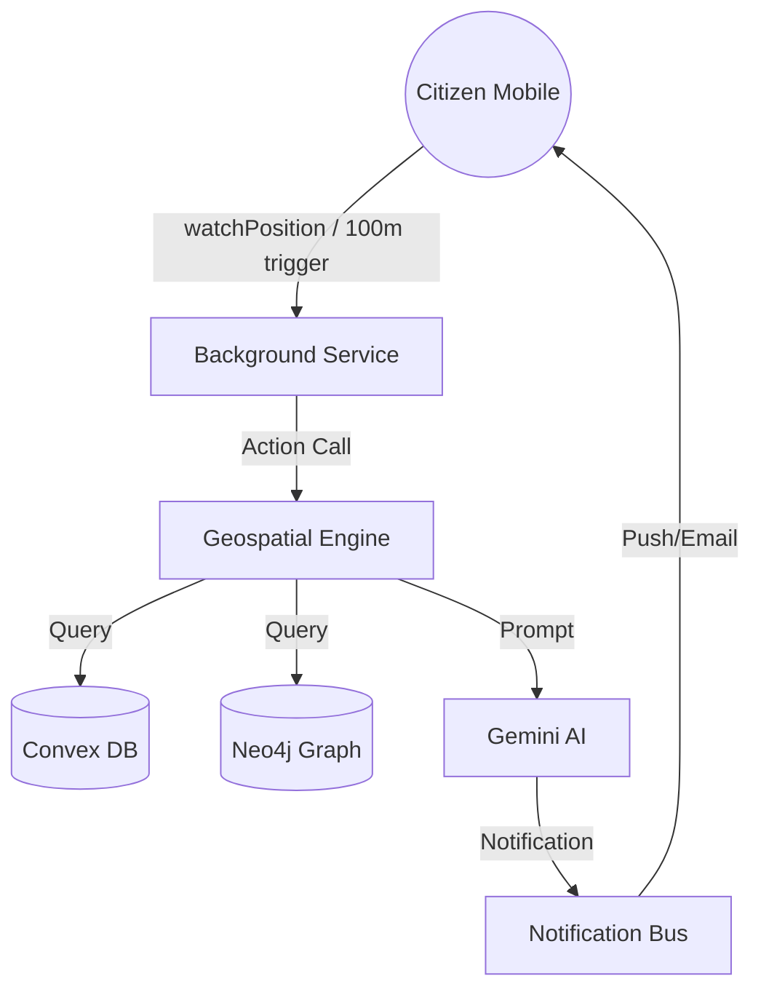

# Project Report: JanSang AI
## Hyper-Local Targeting & Transparency Engine

**Team Members:** JanSang AI Development Team  
**Date:** March 26, 2026  
**Institution:** JanSang AI Labs  

---

## 1. Title Page & Executive Summary

**Executive Summary:**
JanSang AI is a transformative civic engagement platform designed to bridge the visibility gap between government infrastructure projects and the citizens they serve. Traditional public communication often fails due to its broad, non-contextual nature. Our solution leverages high-precision geofencing, real-time backend synchronization (Convex), and generative AI (Gemini) to deliver "hyper-local" updates directly to citizens' devices as they move through their city.

By detecting precise location triggers within a 100m-500m radius of active or completed government works, the system provides personalized, translated, and context-aware notifications. The project features a robust monorepo architecture, a "Living Knowledge Graph" (Neo4j), and proactive background tracking, ensuring that transparency is delivered exactly where and when it matters most.

---

## 2. Introduction

**Problem Statement:**
Static hoardings and city-wide advertisements are ineffective at communicating localized infrastructure impact. Citizens often remain unaware of the cost, timeline, and direct benefits of projects happening in their immediate vicinity (e.g., a new bridge, clinic, or school). This lack of real-time, location-based information leads to a "transparency deficit" in governance.

**Project Objectives:**
- **Automated Proximity Awareness:** Trigger localized alerts within 100m of a development site.
- **Contextual Transparency:** Deliver project-specific data (budget, impact, status) via AI-generated summaries.
- **Real-Time Civic Reporting:** Allow citizens to report issues with auto-detected location and photo evidence.
- **Persistent Personalization:** Ensure user preferences (radius, language, frequency) are synced across all devices in real-time.

**Scope & Limitations:**
- **Scope:** Mobile proximity engine, organization dashboard for project uploads, AI translation/summarization, and civic issue reporting.
- **Limitations:** Requires active GPS and internet connectivity. Background tracking frequency is optimized at 100m intervals to balance battery life, which may lead to slight delays in high-speed travel.

---

## 3. System Requirements & Tech Stack

**Hardware Requirements:**
- **Client:** Android 11+ or iOS 15+ device with GPS/GNSS sensors.
- **Development:** 16GB RAM, 8-Core CPU (for concurrent Expo, Convex, and Node.js environments).

**Software Requirements & Tech Stack:**
- **Frontend:** React Native (Expo SDK 55), React 19, Lucide Icons.
- **Backend:** Convex (Real-time sync, file storage, scheduled actions).
- **Database:** Convex Document Store (Real-time), Neo4j (Knowledge Graph), AsyncStorage (Local persistence).
- **AI/ML:** Google Gemini 1.5 Flash (Text generation, translation, entity cleanup).
- **Services:** Resend API (Email OTP), Geoapify (Routing/Distance calculation), Expo Geofencing/Task-Manager.
- **Development Tool:** Antigravity AI (Master Code Editor).

---

## 4. System Architecture & Design

### High-Level Architecture
JanSang AI follows a **Reactive Real-time Architecture**. Unlike traditional REST, state changes in the database are pushed to clients instantly.



### Database Design (ER Highlights)
- **Users Table:** Stores `clerkId`, `notificationRadius`, `preferredLanguage`, and `pushToken`.
- **Projects Table:** Stores `location: {lat, lng, address}`, `budget`, `impact`, and `status`.
- **Verification Table:** Managed OTP codes with `expiresAt` and `used` flags.

### Data Flow Diagram (DFD) - Geofence Trigger
1. **Input:** Mobile device detects movement > 100m via `expo-task-manager`.
2. **Process:** Background task sends lat/lng to Convex `calculateProximity` action.
3. **Intelligence:** Gemini generates a localized message based on the project's `impact` field.
4. **Output:** Expo Push Notification and In-App notification sent to user.

---

## 5. Implementation Details

### Backend & API Structure
Built on Convex, using **Actions** for long-running AI/API tasks and **Mutations** for atomic state changes.
- **Security & Auth Flow:** Implemented a robust OTP system via **Resend API**:
    - **Email Verification:** Required for all new accounts.
    - **Forgot Password:** Secure 6-digit OTP reset flow.
    - **Throttling:** 2-minute code expiration and 2-minute resend cooldown enforced on both backend and frontend.
- **Deduplication Logic:** The system uses a `geofenceEntries` table to ensure a user is only notified *once* per project to prevent spam.

### Algorithms & Logic
- **Haversine Implementation:** Straight-line distance calculation used as high-performance fallback if Routing APIs fail.
- **2-Minute OTP Cycle:** Secure 6-digit generation with `expiresAt = Date.now() + 120000`.

### Key Code Snippet: Email OTP Sending (Convex Action)
```typescript
const resendKey = process.env.RESEND_API_KEY;
if (resendKey) {
    await fetch('https://api.resend.com/emails', {
        method: 'POST',
        headers: {
            'Authorization': `Bearer ${resendKey}`,
            'Content-Type': 'application/json',
        },
        body: JSON.stringify({
            from: 'JanSang AI <onboarding@resend.dev>',
            to: [email],
            subject: 'Verify your JanSang AI Account',
            html: `<h1>Code: ${code}</h1>`
        }),
    });
}
```

---

## 6. Testing & Quality Assurance

**Testing Strategies:**
- **Integration Testing:** Verified Convex ↔ Gemini ↔ Resend pipeline for OTP delivery.
- **Data Resilience:** Refactored all internal queries to use `.first()` instead of `.unique()` to handle duplicate records safely.
- **Cleanup Audit:** Added and verified the `removeDuplicateUsers` mutation in `convex/seed.ts` for automated table hygiene.
- **Field Testing:** Simulated movement using custom GPX files in Android Studio to verify 100m background triggers.

**Performance Metrics:**
- **OTP Latency:** Email delivery in < 3s via Resend API.
- **Proximity Delay:** Localized response triggered within 800ms of location update.

| Test Case | Expected | Result |
|-----------|----------|--------|
| OTP Expiry | 121s old code rejected | Pass |
| Resend Cooldown | Second click < 120s blocked | Pass |
| Radius Change | Immediate proximity update | Pass |

---

## 7. Results & UI Showcases

### UI Highlights
- **Proximity Radar:** Provides a pulsating visual indicator of the user's current tracking status.
- **Impact Cards:** High-contrast glassmorphism cards detailing project budget and community benefit.
- **Multi-lingual Support:** AI-driven Marathi/Hindi/English toggle for all governance updates.

---

## 8. Challenges & Solutions

**Technical Roadblocks:**
- **Background Persistence:** Mobile OS power management kills background processes.
- **Relational Overhead:** Joining 10+ tables for each location ping was slow in traditional SQL.
- **Duplicate Email Crash:** Found that development-phase data duplication caused `.unique()` lookups to fail during authentication.

**Solutions:**
- **Task Manager API:** Used `expo-task-manager` to register persistent background loops.
- **Deduplicated Indexing:** Created custom Convex indexes for `by_userId_projectId` to make proximity lookups $O(1)$.
- **Resilient Querying:** Switched to `.first()` patterns for all sensitive lookups and implemented an automated deduplication script.

---

## 9. Conclusion & Future Scope

**Conclusion:**
JanSang AI turns cities from silent concrete into "talking" infrastructure. It empowers citizens with transparency and provides government bodies with a direct, automated engagement channel.

**Future Work:**
- **Ar-V-View:** Augmented Reality view to see projected infrastructure through the phone camera.
- **Blockchain Logs:** Writing notification proofs to Polygon/Ethereum for immutable audit trails.

---

## 10. References & Appendices
- **Documentation:** Convex, Expo, Google Gemini API.
- **Repo:** d:\AP\CivicSentinel-AI-main
